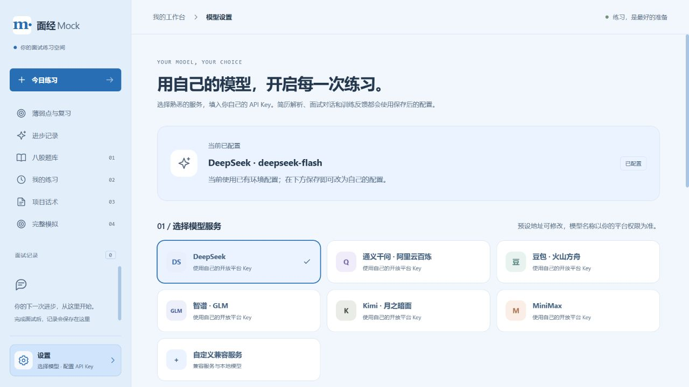
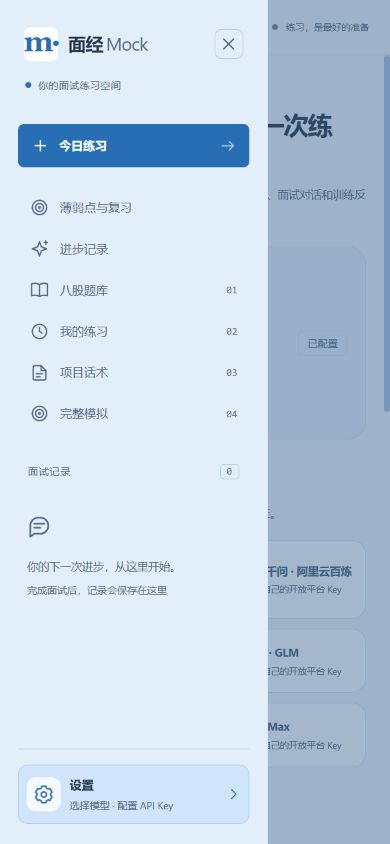
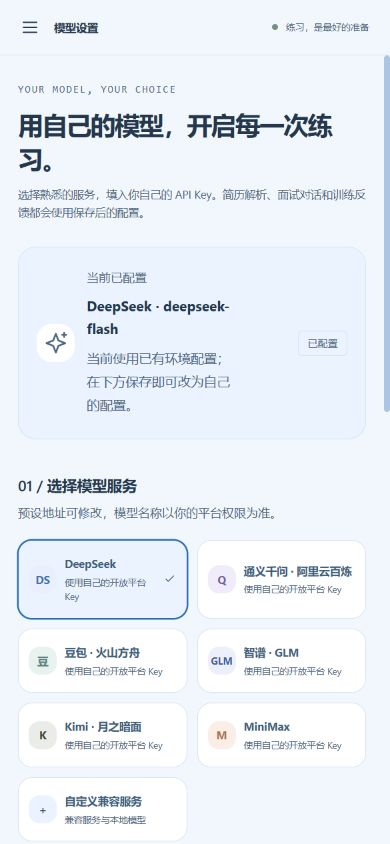

# 淡蓝色界面与设置入口

2026-10-03，曾部署到现有 `coding` 应用容器。随后按用户要求恢复原暖色调，左下角设置入口保留；以下记录为淡蓝色阶段的历史验收。

设置入口移至侧栏左下角，使用齿轮图标和“设置”文字，点击进入 `/settings/model`，选择模型服务并配置自己的 Key。原导航列表的“模型设置”入口移除。手机先打开导航，再使用侧栏底部设置。设置区独立于滚动内容，较矮窗口也保持可见；支持键盘焦点和当前页面标记。

统一刷新主背景、侧栏、主按钮、输入框焦点、题库、复习、项目练习、模型配置和完整模拟页面为淡蓝色。以深蓝文字、白色卡片和蓝色高亮保留阅读层次；错误/警告/掌握状态及服务商标识保留各自含义。主按钮文字对比度约 5.28:1，常规侧栏文字加深以保持可读。

实际验收：

- Docker 内前端生产构建通过，226 个模块；无后端逻辑改动。
- 桌面 1280×720：设置位于左下角并可打开模型选择；选通义千问后，模型 ID 和接口地址正确切换。
- 手机 390×844：模型选项无横向溢出；打开导航后设置可见，点击设置自动收起导航。
- 短窗口 390×500：设置底部位置为 480px，始终位于视口内；导航内容可滚动。
- 题库和原完整模拟页面的配色实际查看通过；页面控制台无错误。
- 演示仅切换未保存表单，未填写或保存 Key，未发起真实模型调用。升级前后模型设置视图相等；180 题、18 类和 Chroma 190 个片段保持正常。

只重建 app，保留所有数据卷；旧镜像保留为 `facemock-app:before-light-blue-ui`。[部署检查](light-blue-deployment-check.json)

