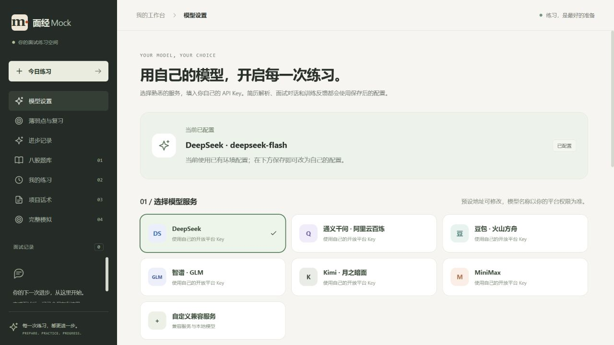
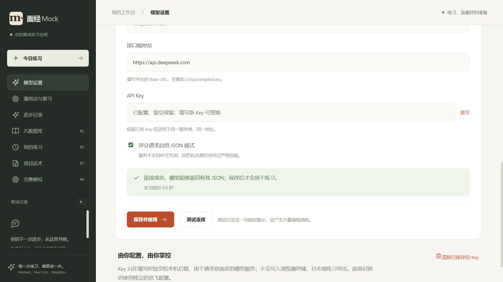

# 用户模型配置验收

日期：2026-10-03。范围为个人自部署实例的自带 Key 与国内模型预设；没有新增多用户账号或凭证隔离。原 P3 的真实语音验收仍需凭证与设备验证；P6 的标签复核与真实试用已移出交付范围。

## 已完成

- 网页 `/settings/model` 可选择 DeepSeek、通义千问、豆包、GLM、Kimi、MiniMax，以及自定义兼容服务；模型 ID 和根地址可编辑。预设依据和地域/权限限制见 [使用说明](model-settings.md)。
- 新部署无需环境文本密钥即可启动；无 Key 时展示配置入口。保留旧环境来源，页面保存优先，后续请求即时生效，重启读取配置卷。
- 简历解析、模拟面试普通/流式对话、单题和项目评分统一使用动态配置。后台单次评分固定配置快照；历史结果不改写，跨厂商结果不冒充同模型对比。
- 测试连接不保存配置，只发固定公开提示。保存后清空输入框；读取接口不返回 Key/密文，浏览器不持久保存 Key，个人练习导出不包含凭证。
- 凭证 AES-256-GCM 加密保存于独立持久卷。留空只保留同服务、同地址的 Key；切换地址/服务商需新 Key。过期修订拒绝覆盖，清除后重启不回退到旧环境 Key。外部 HTTPS、禁止认证重定向与安全错误信息检查通过。

## 检查结果

| 检查 | 结果 |
| --- | --- |
| 后端完整回归 | 216 项：171 通过、45 跳过、0 失败/错误 |
| 新增配置与接口测试 | 7 项通过；包含密文保存/恢复、清除、修订冲突、地址变更、导出脱敏与厂商参数 |
| 原 LangChain4j Agent 动态接入复测 | 2 项接口集成测试通过；普通 FeedbackAgent 与 FollowUpAgent 流式输出均覆盖 |
| 前端 | TypeScript 与生产构建通过，3 项原录音检查通过 |
| 桌面与手机页面 | 预设切换、空 Key 提示、连接反馈通过；390px 视口内容宽度为 390px，无水平溢出，控制台无错误 |
| 现有 DeepSeek 实际连接 | 成功返回有效 JSON，页面显示约 0.8 秒；未保存或替换用户现有 Key |
| `coding` 更新 | 仅重建 app，四项服务运行，健康 UP，知识库 available；新前端资源与 7 项预设可读取 |
| 数据保留 | 与此前交付记录比对：14 份简历、0 次模拟、1 项项目、2 次单题练习、1 次项目练习、0 份录音，数量一致 |

新增测试及 Agent 复测属于完整回归测试集合，不重复相加。45 项跳过是需显式开启的外部服务/真实模型等检查；本轮没有重跑 P6 的真实固定集。测试日志位于忽略目录 `backend/target/model-settings-*.log`，界面与部署证据见 [核验数据](model-settings-deployment-check.json)。

其他厂商没有提供真实 Key，当前验证为官方接口/模型预设核对与本地兼容协议检查，不能宣称全部厂商均真实调用通过。连接成功只证明短请求和 JSON 返回可用，不代表该模型的评分效果已校准；不同模型仍受原有结构、原话和引用校验约束。

## 部署与使用

访问侧栏“模型设置”，填写自己的 Key，测试后“保存并使用”。已有环境 Key 保持原样，本轮没有替用户填入任何新 Key。配置卷为 `facemock_model_settings`，挂载 `/app/data/model-settings`；本次没有数据库迁移，原数据卷继续保留。

保存前镜像已保留为 `facemock-app:before-user-model-settings`。回退时先备份，再将该镜像标记为 `facemock-app:latest` 并只重建 app；不要删除数据卷。备份网页配置时同时保管 `model.json` 与 `master.key`；拥有整个卷读取权限的人仍可解密凭证，因此当前适用于本人管理的个人实例。

手机界面见 [截图](screenshots/model-settings-mobile.png)。
