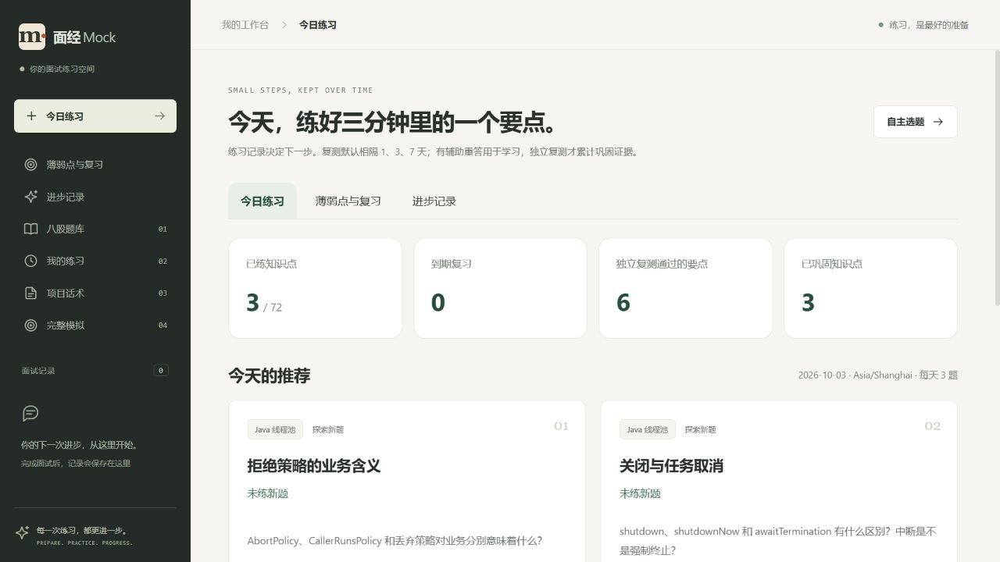
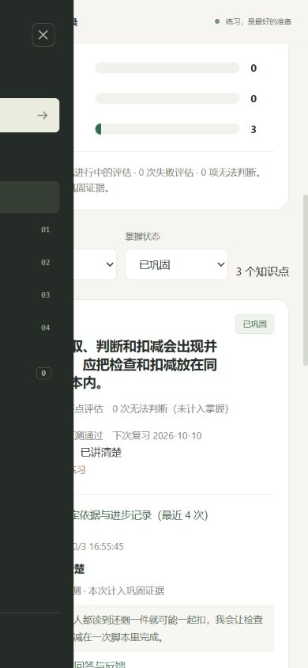

# P5 验收记录

日期：2026-10-03。范围：薄弱点、每日计划、进步证据、可配置复习和独立延迟复测。个人自部署，单人档案。

## 交付

首页 `/` 为今日练习；`/review` 为薄弱点与复习，`/progress` 为进步记录，完整模拟移至 `/mock`。基于稳定知识点 ID，把成功评估账本、知识点投影、到期任务和设置保存在 MySQL。独立回答、有辅助重答、无法判断、评估失败各自呈现。

默认每天 3 题，按到期、尚未解决的错误/遗漏、新题排序；同题去重。复测默认本地自然日 1/3/7 天，两次到期无辅助独立通过进入已巩固。设置支持间隔、时区、题量、巩固次数、暂停与当天跳过。具体规则、接口及边界见 [复习说明](review.md)。

## 验收证据

- 自动检查：日期边界、同日不重复累计、辅助回答、无法判断与失败排除、幂等请求、规则修改、删除基线、跨题稳定知识点合并、推荐排序、跳过和暂停恢复。真实独立 MySQL 中重跑业务测试；完整回归及最终外部复测合并为 207 项通过、3 项可选检查跳过，0 失败，详见 [测试汇总](p5-p6-test-summary.json)。
- [真实 HTTP 流程](p5-http-acceptance.json)：独立 MySQL / Redis / ChromaDB / BGE，实际模型完成首答、有辅助重答、两次独立复测；首答前复测解析返回 409；重复请求与重复进度查询没有多算；3 个要点各有 2 次通过，合计 6 项通过证据。
- [恢复和删除记录](p5-recovery-acceptance.json)：应用重启并清空**测试 Redis**后进度完全相同；不可达模型使评估失败且不计进度；恢复模型后同一回答重试成功；删除首答基线后从剩余账本重算，删除全部相关练习后次数与到期任务清零。
- 前端生产构建和 3 项既有录音检查通过。浏览器 1280×720 / 390×844 检查今日推荐、掌握筛选、原话证据、设置和原完整模拟入口；手机文档宽度 390，没有横向溢出。没有浏览器错误日志。

**时间夹具说明：** 验收在 `coding-p5-acceptance-*` 独立环境，向测试回答写入历史日期来验证多日规则。没有修改用户数据库；没有真实等候数日，不把此流程当作真实学习效果。

## 限制

复测是同一道题换情境提示，并非验证等价的新题库；普通练习和追问不会自动累计延迟通过。日期采用自然日，不保证精确 24 小时。当前查询确定性重放个人全部成功评估，适合个人体量；大规模服务需要增量投影与所有权校验。规则为初始配置，没有真实多日使用效果数据。P3 真实 ASR 和设备验收维持待补。
