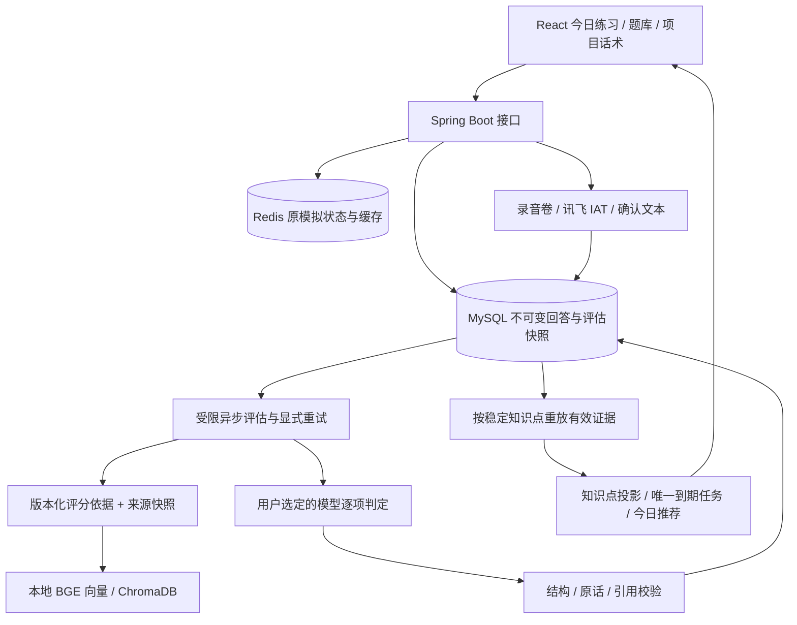

# 架构、复现与交付

日期：2026-10-03。个人自部署、单人档案、单应用实例。P5 已验收；P6 按调整后的交付范围完成；P3 实际语音和设备验收待补。

## 数据链路



复习不依赖 Redis 的全局薄弱点；MySQL 账本是事实来源。资料不足不自动认可正确；模型失败保留回答、允许有限重试。项目资料按项目与修订隔离，旧评估保留当时的材料证据。引用存在不等于语义判断必然正确。

## 从干净环境启动

需要 Docker Desktop / Docker Compose。复制 `.env.example` 为 `.env`，文本密钥可留空，启动后在“模型设置”选择服务商并填写自己的 Key；不要提交 `.env`。已有 `DEEPSEEK_API_KEY` 继续作为初始来源，网页保存后优先使用持久配置，详见 [模型设置说明](model-settings.md)。首次运行会下载依赖、本地 BGE 模型并导入 180 题（18 类）和基础知识，等待 `/api/health` 为 UP、`/api/knowledge/status` 为 available 再演示。

```sh
docker compose -p facemock up -d --build
docker compose -p facemock ps
```

访问 `http://localhost:8080`。需要另一个干净实例时，在不同目录或指定不同项目名与 `APP_PORT`，避免占用原卷和端口。MySQL/Redis/Chroma 为服务内部端口。Chroma 固定镜像摘要与 `/data` 挂载见 Compose。依赖暂不可用时按界面提示恢复，不能仅凭健康接口证明知识库已经就绪。

语音默认关闭。开启讯飞 IAT 需 `SPEECH_ENABLED=true` 和 `XFYUN_APP_ID`、`XFYUN_API_KEY`、`XFYUN_API_SECRET`，详见 [语音说明](speech.md)。文本模型密钥不能识别音频。未提供文本密钥时，回答仍可保存，但模型评估失败；不要将失败计为掌握。

## P5/P6 数据变更与备份

沿用项目 `spring.jpa.hibernate.ddl-auto=update` 的初始化方式，干净库由实体生成结构。P5 增加 `review_profile`、`knowledge_progress`、`review_task` 三表；`practice_session` 增加 nullable `review_point_id`、`review_due_date`；P6 `practice_evaluation` 增加 nullable `telemetry_json`。既有练习默认无复测字段，由原成功评估重算基线，不被算成独立复测。旧评估没有 usage 是未知，不填零。

本次在独立 MySQL 验证新建结构，并在已有 `coding` 卷上实际启动更新；[部署核验](p5-p6-deployment-check.json)记录原有数据数量和新入口。迁移前已保留 `facemock-app:before-p5-update` 及本地忽略目录 `backend/target/coding-before-p5-update.sql`。SQL 备份含个人资料，不作为公开交付文件。

常规升级保留数据卷，只重建 app。回退先停止 app 并备份当前数据，把保留镜像重新标记为 `facemock-app:latest`，再执行 `docker compose -p facemock up -d --no-build --no-deps app`。旧版不读取新列/表，保留结构即可；恢复历史数据库会丢失备份后新增记录，需由本人明确决定。不要使用 `down -v` 来升级。本轮专用验收应用进程和三个 `coding-p5-acceptance-*` 容器及测试卷已清理，`coding` 四项服务继续运行。

JSON 导出包含简历文件（Base64）、文字、练习与材料快照、复习设置、评估及已知调用消耗；不含环境密钥或录音二进制。它供阅读和迁移准备，**没有自动导入/恢复接口**。完整恢复还需 MySQL 与 `speech_recordings`、Chroma 数据卷备份。删除练习会级联删除其追问、回答、评估、录音和转写，随后复习重算；删除项目当前材料仍保留旧练习快照，详见 P4 说明。

## 复现检查

本地需要 Java 17、Maven、Node.js 和 Python 3。常规测试不请求真实模型。

```sh
cd backend
mvn test
cd ../frontend
npm ci
npm run test:audio
npm run build
```

真实模型固定集（PowerShell，从项目根目录；Maven 在 PATH，密钥在本地 `.env`）：

```powershell
./backend/src/test/scripts/evaluate-p6.ps1 -ReportPath target/p6-model-rerun.json -RagUrl http://localhost:8080
python backend/src/test/scripts/summarize-p6.py backend/target/p6-model-rerun.json --output backend/target/p6-metrics-rerun.json
python backend/src/test/scripts/verify-p6-retrieval.py --help
```

重复评测会产生实际模型调用费用，独立保存报告。公开固定集可用于演示；不要把私人简历写入固定集。数据集生成器 `build-p6-dataset.py`、校验 `P6DatasetTest`、真实评分 `P6ModelEvaluationTest`、汇总脚本均保留。完整统计见 [最终测试汇总](p5-p6-test-summary.json)；可选外部测试通过环境变量启用，P3 实际 ASR 当前仍未运行。

`p5-http-acceptance.py` 和 `p5-recovery-acceptance.py` 专用于命名为 `coding-p5-acceptance-*` 的一次性测试环境，不能直接对用户数据库运行。其历史日期为夹具，恢复脚本会清空测试 Redis、删除合成记录。脚本中的公开测试密码仅用于隔离测试容器。

## 五分钟演示

1. 今日练习展示推荐理由，选 Redis Lua 题，独立回答“用 Redis Lua，因为 Lua 是原子的”。
2. 查看逐项缺口、本人原话和资料出处；打开解析后重答，展示新增覆盖与“有辅助”标记。
3. 基于薄弱要点建立追问，说明它复用稳定知识点，答案仍保存为独立记录。
4. 打开进步页解释待巩固、到期日与独立通过次数；实际到期后通过“独立复测”作答，首答前看不到提示/解析。现场不能用改日期冒充真实记忆保持。
5. 用公开合成项目材料展示个人职责与事实不足边界，再展示固定集 5 项判定差异及实际验证范围。

录音演示须等真实服务与设备验收完成再加入，不用模拟转写替代。面试中可重点解释：不可变快照、幂等任务、来源校验、失败降级、复习回算、样本分母和当前单人边界。

## 简历描述草稿

> 开发面向 Java 后端求职者的面试训练系统，基于 Spring Boot、MySQL、Redis、ChromaDB 与 React，实现带来源的逐项回答反馈、重答对比、项目事实材料检索和知识点延迟复测。通过不可变回答与评估快照、幂等异步任务、引用校验和可回算进度，支持失败恢复与数据导出；建立 60 条固定样例评测及判定差异报告。

如果写固定集数字，必须注明“开发固定集、评分依据派生预期”，不能写成“准确率 97%”或虚构用户提升。真实 ASR 与多用户隔离尚未验收，不写成已交付能力。
