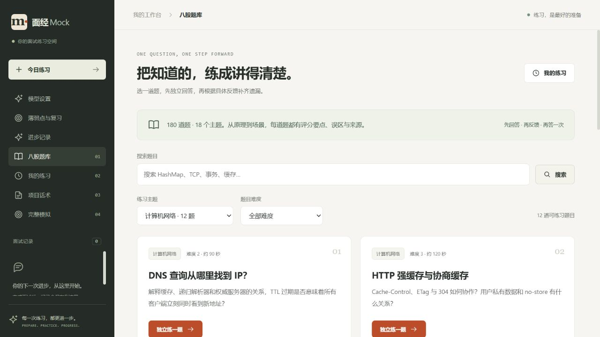

# 题库扩充验收

日期：2026-10-03。已更新现有 Docker Compose 项目 `coding`，只重建应用容器，保留 MySQL、Redis、Chroma、录音和模型设置数据卷。

## 交付结果

- 题目：24 → **180**，新增 156；分类：6 → **18**；评分知识点：72 → **540**。
- 180 份版本化来源卡片已索引，连同原 10 份基础知识，Chroma 共 **190 个片段**。
- 新增标题搜索、分类题数统计，支持与主题/难度/分页组合。
- 新题可沿用既有练习、解析、追问、重答和复习链路；新评分点初始未练习。
- 旧 24 题资源原样保留，未改写已有题目版本或旧会话快照。

## 已完成的检查

| 检查 | 实际结果 |
|---|---|
| 完整后端回归 | 219 项，174 通过，45 按环境开关跳过，0 失败/错误 |
| 前端生产构建 | 通过，226 个模块 |
| 题库结构 | 180 题、540 个评分点、180 个来源；18 类完整且每类至少 6 题 |
| 旧库升级 | 24 题导入后追加 156 题；旧快照相等；重复导入无新增修订 |
| 实际数据库查询 | 18 类题数逐项一致，15 页覆盖 180 个唯一 ID |
| 搜索 | 英文大小写忽略；主题组合正确；百分号/下划线按字面匹配；81 字查询返回 400 |
| 公共响应 | 列表不返回解析/评分标准；原 24 题公共详情与旧资源一致 |
| 实际 RAG 抽查 | 每类一题，共 18 题，本题绑定资料均排第 1；内容、URL 与来源卡片一致 |
| 新题练习流程 | 18 类各创建一条临时练习，解析/评分点/来源/提示/结束正常，随后仅清理本轮创建的会话 |
| UI | 桌面 1280 像素、手机 390×844；搜索、分类筛选、进入 MyBatis 新题及展开解析正常；无横向溢出、无页面控制台错误 |
| 实际二次启动 | 日志：180 道，新增版本 0，未变化 180；180 篇参考索引完成，片段仍为 190 |

完整回归含题库、旧模拟状态机、知识检索、文字训练、语音、项目训练、复习、导出和用户模型设置检查。45 项跳过主要涉及单独外部测试环境与真实模型开关，不能计为通过。本轮实际部署检查使用现有 MySQL/Chroma；没有运行新题真实模型判分，也没有外部人工标签评测。

检索初查仅使用题干时，MyBatis 参数绑定与 SQL 注入两道题未命中自己的前五来源。补充标题作为生产检索上下文后，两题均排第 1，并重跑完整回归。18 题属于代表性抽查；这不是 180 题全部答案的检索召回率，更不是评分准确率。未命中或检索故障仍保持明确的有限评估提示与来源绑定校验。

## 数据与部署

升级前保留镜像 `facemock-app:before-question-expansion`，数据库备份位于本地忽略目录 `backend/target/coding-before-question-expansion.sql`。备份包含私人资料，不纳入公开验收文件。原 `.env` 与个人模型设置未修改。

| 个人数据 | 升级前 | 临时验收数据清理后 |
|---|---:|---:|
| 简历 | 14 | 14 |
| 模拟面试 | 0 | 0 |
| 项目 | 1 | 1 |
| 八股练习 | 2 | 2 |
| 项目练习 | 1 | 1 |
| 录音 | 0 | 0 |

顺带修正 Git 忽略规则：数据卷规则误匹配 Java 的 `service/data` 源码目录，现对该源码目录显式豁免，保证导出服务可纳入交付。

可复核的公开结果：[部署检查](question-expansion-deployment-check.json)、[18 类练习检查](question-expansion-workflow-check.json)、[覆盖范围与来源方法](question-expansion.md)。日志在 `backend/target/question-expansion-*.log`，不作为公开交付内容。

复现：

```sh
# 首项只读，验证目录、搜索、旧题、RAG 和私人数据的数量。
python backend/src/test/scripts/check-question-expansion.py
# 次项创建临时无回答练习，校验解析后删除准确的临时 ID，不调用模型。
python backend/src/test/scripts/check-question-expansion-workflow.py
```

首项需要本机升级前保存的数量快照 `backend/target/question-expansion-before.json`；新部署时应自行建立基线，而非把本机私人数据数量当作固定标准。

## 页面




新增题干、解析和评分标准为原创训练内容，附原始资料链接，未复制小林 coding 或 JavaGuide 的文章。历史 P2/P6 固定集成绩保持原验收范围；新增 156 题评分校准已移出交付范围，不以历史固定集成绩代表新题准确率。讯飞真实语音仍需凭证与实录验证。
