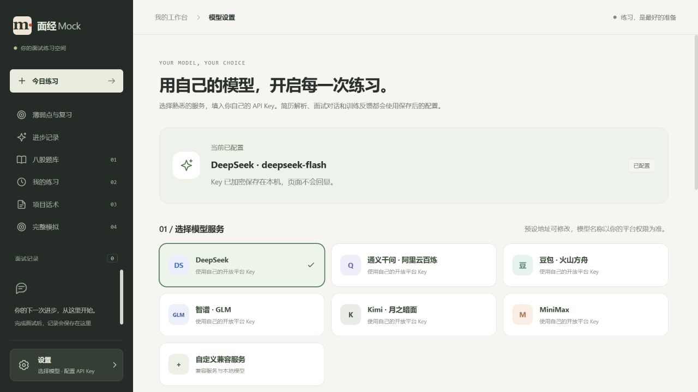

# 恢复原配色

2026-10-03，按用户要求从保留的原版本样式恢复五个页面样式文件：米白主背景 `#f6f5f1`、深绿侧栏 `#252c28`、暖橙主按钮 `#bb4d2a`。左下角齿轮设置、模型选择和短窗口固定设置区保留。

已重建并更新 `coding` 应用，前端 226 个模块构建通过；桌面实际配色核对与 390×500 手机设置可见性检查通过，无页面错误。当前模型配置保持一致，所有数据卷保留。

